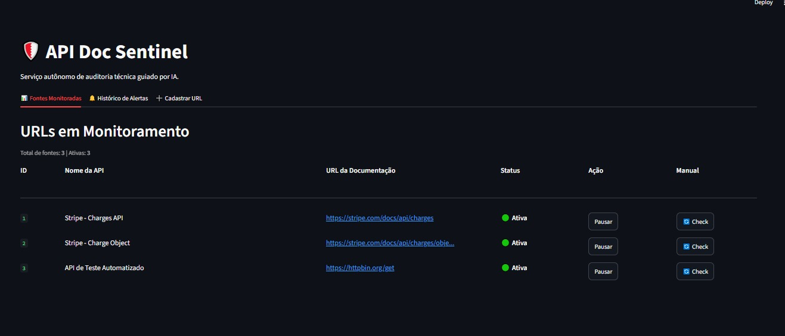
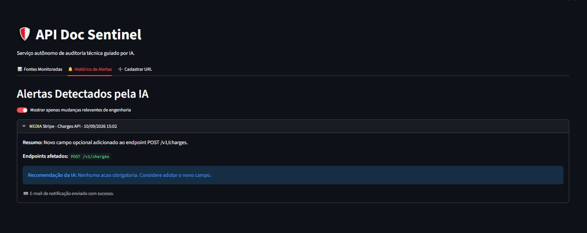
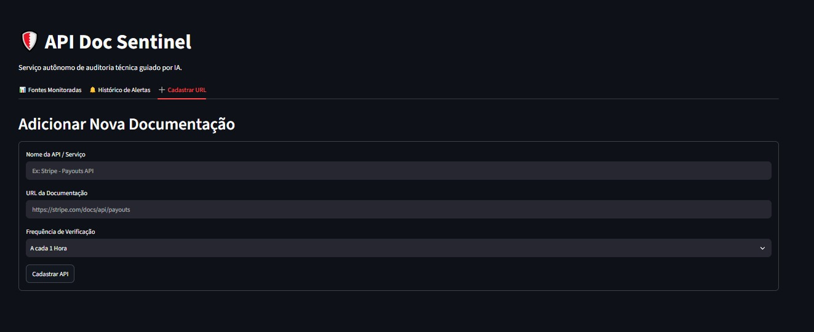
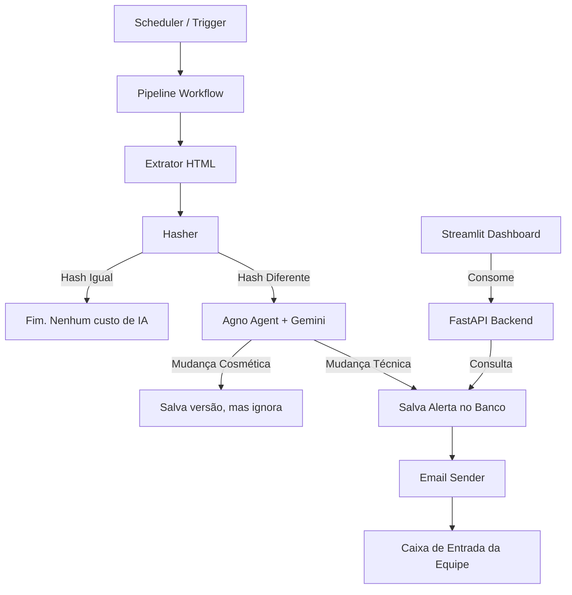

# API Doc Sentinel 🛡️

O **API Doc Sentinel** é um serviço autônomo de auditoria de documentação técnica. Criado para times de engenharia, e-commerces e marketplaces, ele monitora periodicamente páginas de documentação de APIs de terceiros e avisa você por e-mail **apenas quando uma mudança de engenharia relevante acontece**.

Adeus a ficar lendo *changelogs* ou sofrer com quebras de integração silenciosas!

## 📸 Telas do Sistema
<div align="center">
  
  <br/><br/>
  
  <br/><br/>
  
</div>

## Como funciona?

O sistema usa uma abordagem híbrida inteligente para economizar tokens e garantir precisão:

1. **Agendador (APScheduler)**: Acorda de hora em hora (ou conforme configurado) e verifica a lista de URLs.
2. **Extrator**: Baixa o HTML da página e o limpa para Markdown.
3. **Hasher Determinístico**: Calcula o hash SHA-256 do texto. Se for igual ao da última vez, a página não mudou. O sistema para aqui e **não gasta 1 centavo com IA**.
4. **Auditor IA (Agno + Gemini)**: Se o hash mudou, o novo texto é enviado para o Gemini. A IA analisa se foi uma mudança cosmética (ex: erro de digitação corrigido) ou uma mudança técnica (ex: novo campo obrigatório, endpoint depreciado).
5. **E-mail Inteligente**: Se for uma mudança relevante, você recebe um e-mail com a severidade, resumo e ação recomendada gerada pela IA.

### 🏗️ Arquitetura do Sistema



---

## 🚀 Como instalar e rodar (Guia Rápido)

Este projeto usa o **`uv`** como gerenciador de pacotes ultrarrápido do Python.

### 1. Preparando o Ambiente
Clone o repositório e instale as dependências.
Se você usa o `uv` (recomendado):
```bash
uv sync
```
Ou se usa o tradicional `pip`:
```bash
pip install -r requirements.txt
```

### 2. Configurando Senhas e APIs
Copie o arquivo de exemplo para criar o seu `.env`:
```bash
cp .env.example .env
```
Abra o arquivo `.env` e preencha:
- **`GOOGLE_API_KEY`**: Sua chave do Gemini (pegue em aistudio.google.com).
- **`EMAIL_SENDER` / `EMAIL_RECIPIENT`**: Seu e-mail (quem envia e quem recebe).
- **`EMAIL_PASSWORD`**: Use uma **Senha de Aplicativo** gerada na sua conta Google (não é sua senha normal!).

### 3. Subindo o Sistema (2 Terminais necessários)

O sistema é dividido em duas partes (Backend/Motor e Frontend/Painel).

**Terminal 1 — O Motor (FastAPI + Scheduler):**
```bash
uv run uvicorn main:app
```
*(Deixe esse terminal rodando. Ele é o cérebro que fará as checagens e enviará os e-mails).*

**Terminal 2 — O Painel Visual (Streamlit):**
```bash
uv run streamlit run app/streamlit_app.py
```
*(Isso vai abrir uma aba no seu navegador automaticamente).*

---

## 🖥️ Como usar o Painel

Pelo painel do Streamlit (geralmente em `http://localhost:8501`), você pode:

- **Cadastrar URL**: Adicione o link de qualquer documentação que você queira vigiar (ex: documentação da Stripe, Mercado Livre, Shopify).
- **Acompanhar Monitoramento**: Veja o status de todas as URLs. Você pode **pausar** o monitoramento de uma URL ou forçar uma **checagem manual** imediata apertando no botão `🔄 Check`.
- **Ler Alertas**: O feed onde os achados da inteligência artificial aparecem, com selos coloridos indicando a severidade.

## Stack Tecnológica
- **Python 3.12**
- **[Agno](https://github.com/agno-agi/agno)** para orquestração da IA e parsing estruturado via Pydantic
- **Google Gemini 3.1 Pro**
- **FastAPI** para o backend
- **APScheduler** para tarefas de fundo
- **SQLAlchemy + SQLite** para persistência
- **Streamlit** para o Frontend Administrativo
